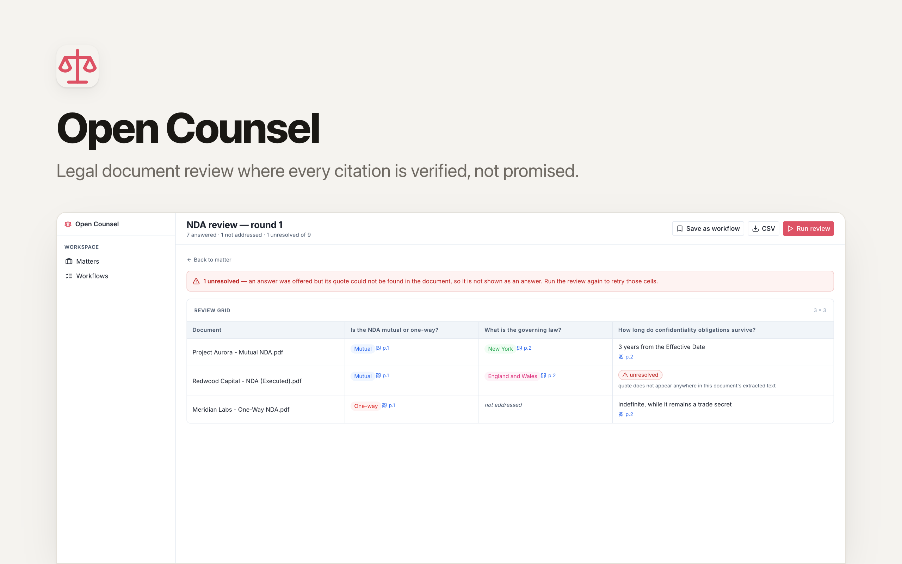

# OpenCounsel

[](https://app.clawnify.com/deploy?repo=clawnify/open-counsel)

Matter-scoped document review for legal teams — where a citation is **checked, not promised**.

Upload the contracts, write the questions once, and let your AI agent fill a spreadsheet-style grid across every document. Every answer must carry a quote copied from the source, and the app locates that quote in the document's own text before it will display it as an answer. A quote it cannot find is shown as **unresolved**, never as a result.

An open-source app template provided by [Clawnify.com](https://clawnify.com).

## Why this exists

Ask any capable model to "review these 40 NDAs and cite your sources" and most of the answers will be right. The problem is the rest: a fluent, plausible answer with a page number attached, quoting a sentence that does not exist. In a diligence pack that is worse than a blank cell, because it survives review — nobody re-reads the clause that already has a citation.

So OpenCounsel doesn't ask for citations. It verifies them:

```
answer + quote + page  →  is that quote really in the text?
                             ├── yes → stored as an answer
                             └── no  → stored as unresolved, and the reviewer is told why
```

The check is mechanical — a normalised substring match against the extracted text of that document — so it holds no matter which model, prompt or version produced the answer. It tolerates the things that legitimately differ (smart quotes, line breaks, hyphenation, a clause running across a page break) and nothing that changes meaning.

## Features

- **Matters** — a workspace per deal, case or client, holding its documents and reviews.
- **Documents** — PDF, DOCX and plain text. Text is extracted on upload, page by page, and that text is what citations are checked against.
- **Tabular review** — a grid of documents × questions. Each cell is an answer, the page, and the verbatim quote it came from, one click away.
- **Three honest cell states** — *answered* (verified), *not addressed* (the document genuinely doesn't say), *unresolved* (evidence failed the check). The third never looks like the first.
- **A library of review criteria, built in** — 11 practitioner-authored column sets (NDA, credit agreement, commercial lease, SPA, shareholder agreement, LPA, employment, supply, commercial agreement, change-of-control, e-discovery — 166 columns in total), bundled under the MIT licence. Import one and it becomes yours to edit.
- **Workflows** — save the columns of a review that worked; the next matter starts from it in one click.
- **Redlining** — say what you want changed and get a Word file with real tracked changes, ready to send to the other side.
- **CSV export** — the page and quote travel with every answer, so the evidence doesn't get lost when the grid leaves the app.

## Redlining

Reviewing a contract is half the job. The other half is changing it — and that has to leave in the format the negotiation actually happens in: a `.docx` with tracked changes that opposing counsel opens in Word and accepts or rejects clause by clause. A list of suggestions in a web app is not that.

Say what you want ("cap our liability at 12 months' fees, make confidentiality mutual"), and your agent reads the document and proposes **anchored edits** — each one quoting the exact text it replaces. You approve them, and the app produces the Word file.

The same discipline as citations applies, one notch tighter. An anchor must name **exactly one** passage in the document:

```
"the aggregate liability of the Supplier shall be unlimited"
    ├── found once   → this clause will be changed
    ├── found twice  → refused: replacing it would rewrite a clause nobody chose
    └── not found    → refused: it isn't in the document
```

Contracts restate the same wording in every schedule, which is exactly why the first match is never assumed to be the intended one.

Everything nobody anchored comes through **byte-identical** — numbering, styles, tables, footnotes — because the file is edited, never re-authored. So the tracked changes are the edits you approved and nothing else, instead of fifty reflowed paragraphs with the four real changes buried inside them.

## How it works

| | |
|---|---|
| **The app** | stores documents, extracts their text, holds the grid, verifies every citation and every anchor, and writes the redline |
| **Your agent** | reads the documents, answers the questions, and proposes the changes |
| **You** | approve |

The app has no model provider keys and no chat window, on purpose — your Clawnify agent already is the reader, reachable from the dashboard, WhatsApp or email. Press **Run review** and the review is handed to it; if it can't be reached, you get the brief to paste into chat instead.

## Local development

Requires Node 20+ and pnpm.

```bash
pnpm install
pnpm dev          # UI on :5173, API on :8789
```

```bash
pnpm test         # verification rules
pnpm typecheck
pnpm build
```

Off-platform there is no agent to dispatch to — **Run review** and **Propose changes** hand you the brief to copy instead. Building a redline needs the platform's document service, so that one is only available once deployed; the edits and their verification work locally.

## Deploy

Deploy it to your own Clawnify organisation:

```bash
npx clawnify deploy
```

Or use the button in the [Clawnify app directory](https://app.clawnify.com). Each deployment gets its own database and file storage — the documents stay inside your own organisation.

## Extending it

- **New question types** — `review_columns.type` already carries `text | enum | date | money | boolean`; the grid renders them as text today.
- **Case law** — citation verification against a case-law source (e.g. CourtListener) is the natural next column type, and slots in beside the quote check rather than replacing it.
- **The verification rule** lives in one file, `src/server/citations.ts`, with its tests beside it. That is the file to read first, and the one to be careful with.

## Licence

MIT. See [LICENSE](LICENSE).

The bundled review column sets are third-party content, also MIT, vendored at a pinned revision and adapted to this app's column schema. Copyright notice, attribution and modification notice: [NOTICE.md](NOTICE.md). Refresh them with `node scripts/refresh-packs.mjs`.

This project is an independent implementation and is not affiliated with, derived from, or endorsed by any other legal-AI product.
